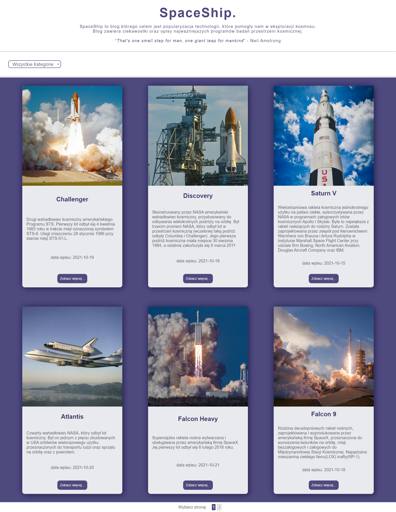

# Blog

Blog is about spacecraft, includes two categories: rockets and shuttles. In this project I used [prismic](https://prismic.io/) to create contents that are downloaded from [API](https://prismic.io/docs/technologies/introduction-to-the-content-query-api). You can select a category that interests you and view the post. The website uses pagination.

**Main features**:
- React
- React Route
- Styled Components

&nbsp;
 
## 💡 Technologies


&nbsp;
 
## 💿 Installation

The project uses [node](https://nodejs.org/en/) and [npm](https://www.npmjs.com/). Having them installed, type into the terminal: `npm i`.
&nbsp;

## 🤔 Solutions provided in the project

1. Example of the pagination used in this project.
```
const Pagination = (props) => {
	const activeClass = 'active';
	const {categor = '', page} = useParams();
	const path = `/categor,${categor}`;
	const {children, limit = 6} = props;
	const length = children.length;
	const begin = limit * (page - 1);
	const end = page * limit;
	const pages = Math.ceil(length / limit);
	const links = (new Array(pages).fill(0)).map((item, index) => <li key={index}>
			<StyledLink activeClassName={activeClass} to={`${path}/${index + 1}`}>{index + 1}</StyledLink>
		</li>
	);
	...
```

2. Prismic configuration.
```
import Prismic from '@prismicio/client';

const apiEndpoint = 'https://myspaceblog.prismic.io/api/v2';
const accessToken = '';

const fetchData = async (type) => {
	const client = Prismic.client(apiEndpoint, { accessToken });
	const response = await client.query(Prismic.Predicates.at('document.type', type));

    if(response) {
		return response;
	}
}

export default fetchData;
```
&nbsp;

## 🙋‍♂️ Feel free to contact me

Find me on...

<p align="center">
	<a href="https://github.com/domas-mo"></a>
	<a href="https://www.linkedin.com/in/dominik-mo/"></a>
    <a href="mailto:dominik.mozdzen1@gmail.com"></a>
</p>
&nbsp;

## 👏 Thanks / Special thanks / Credits

To my [Mentor - devmentor.pl](https://devmentor.pl/) - for providing me with this task and for code review.
